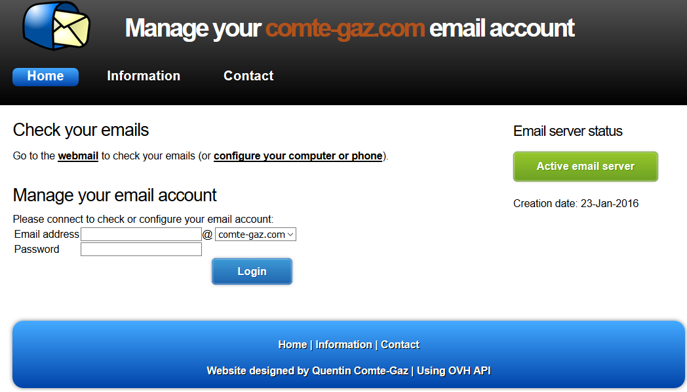
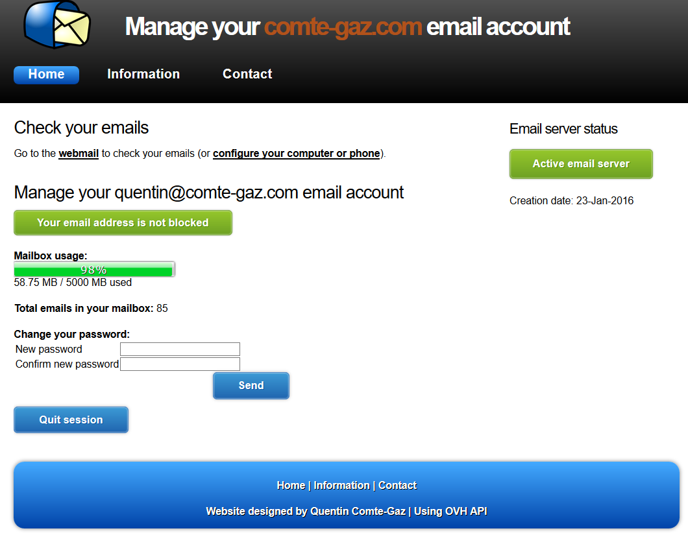
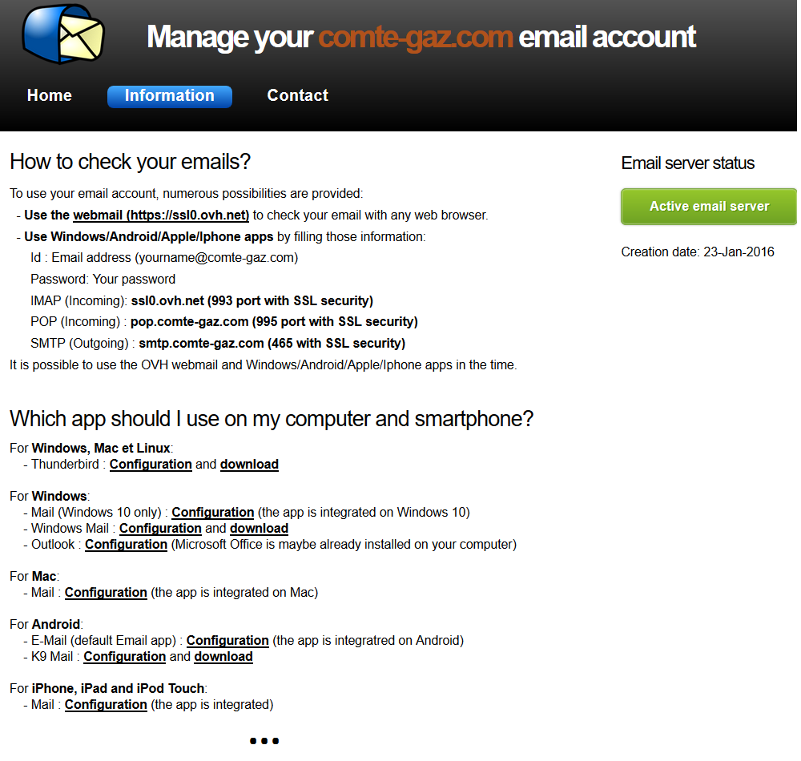

# OVH Email Manager Website

## What is it?

This project is a website allowing user to manage its OVH email account and change its password.

It uses the <a target="_blank" href="https://api.ovh.com">OVH API</a>.

The main goal is to allow user to manage personal email account without having access to the full OVH buyer account.
Indeed, OVH does not provide user interface to manage email account password without having access to all email accounts.

## How to install

1) Download this project

2) Update the <a target="_blank" href="https://github.com/QuentinCG/OVH-Email-Manager-Website/blob/master/config_example.php">config_example.php</a> file and rename it to "config.php" (all the steps are detailed in the file).

3) Store the website in a PHP 5 compatible web server. It is also more than recommended to install SSL on your web server (passwords are exchanged between the user and the server).

Note: If you want to integrate the functionality on your <b>own website and design</b>, the easiest way is to copy the APIs (vendor folder),
the <a target="_blank" href="https://github.com/QuentinCG/OVH-Email-Manager-Website/blob/master/imap_utility.php">imap_utility.php</a> and
<a target="_blank" href="https://github.com/QuentinCG/OVH-Email-Manager-Website/blob/master/ovh_utility.php">ovh_utility.php</a> files to your web server.
You'll then have to create a new instance of the OVH API and use functions in those files to manage what you really want.

## License

This project is under MIT license. This means you can use it as you want (just don't delete the library header).

Note that this project uses Third party APIs and scripts (BSD and MIT license):
 - OVH (PHP API): BSD license
 - JQuery (JS): MIT license
 - Modernizr (JS): MIT license
 - Composer (PHP API used by the OVH API): MIT license
 - GuzzleHTTP (PHP API used by the OVH API): MIT license
 - PSR (PHP API used by the OVH API): MIT license

## Contribute

If you want to improve this website, just create a pull request with proper commit message and right wrapping.